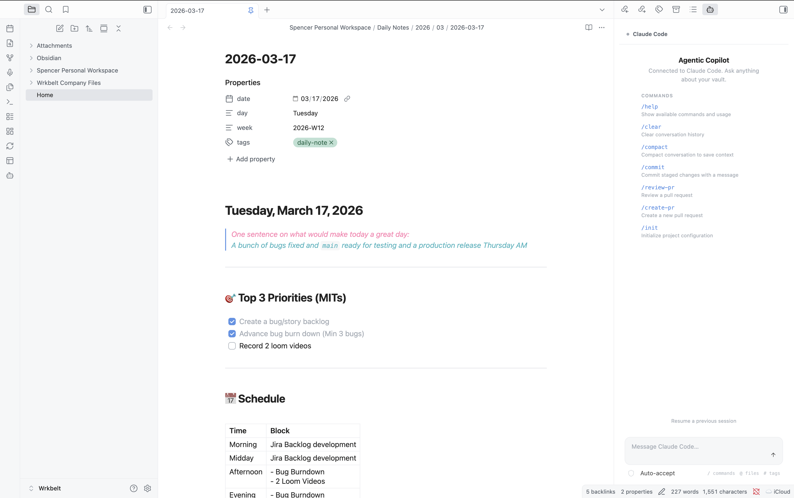

<p align="center">
  
</p>

<h1 align="center">Agentic Copilot</h1>

<p align="center">
  <strong>Bring agentic CLI tools into Obsidian as a workspace copilot.</strong><br />
  Claude Code &bull; Opencode &bull; Gemini CLI &bull; Any custom agent
</p>

<p align="center">
  <a href="https://github.com/spencermarx/obsidian-ai/releases/latest"></a>
  <a href="https://github.com/spencermarx/obsidian-ai/releases"></a>
  <a href="https://github.com/spencermarx/obsidian-ai/stargazers"></a>
  <a href="https://github.com/spencermarx/obsidian-ai/blob/main/LICENSE"></a>
  = 1.5.0" />
  
  <a href="https://github.com/spencermarx/obsidian-ai/issues"></a>
  <a href="https://github.com/spencermarx/obsidian-ai/pulls"></a>
</p>

<br />

> **Agentic Copilot** is a thin orchestration layer that connects Obsidian to whatever agentic coding tool you already use. It doesn't reinvent the wheel — it gives the wheel a steering column inside your knowledge base. Auto-detects your environment. Zero configuration required.

<br />

## Table of Contents

- [Why Agentic Copilot?](#why-agentic-copilot)
- [Quickstart](#quickstart)
- [Features](#features)
- [Supported Agents](#supported-agents)
- [Commands](#commands)
- [Configuration](#configuration)
- [How It Works](#how-it-works)
- [Development](#development)
- [Troubleshooting](#troubleshooting)
- [FAQ](#faq)
- [Contributing](#contributing)
- [License](#license)

---

## Why Agentic Copilot?

Most AI plugins ship their own LLM integration, locking you into a specific provider and model. **Agentic Copilot takes a different approach**: it connects to the CLI tools you already have installed — tools that handle auth, model selection, context windows, and tool use on their own.

```
You (Obsidian) <-> Agentic Copilot <-> CLI Agent <-> LLM Provider
                   ~~~~~~~~~~~~~~~
                   (this plugin)
```

**What you get:**
- Use the same agent, same config, same API keys as your terminal workflow
- Every improvement to Claude Code / Opencode / Gemini CLI lands in Obsidian automatically
- Swap agents with a single command — no settings migration, no API key juggling
- Your data never touches an intermediary — it flows directly from plugin to your local CLI tool

---

## Quickstart

### 1. Install a CLI agent

```bash
# Claude Code (recommended)
npm install -g @anthropic-ai/claude-code

# — or —

# Opencode
curl -fsSL https://opencode.ai/install | bash
```

### 2. Install the plugin

| Method | Steps |
|--------|-------|
| **Community Plugins** | Settings → Community Plugins → Browse → search **"Agentic Copilot"** → Install → Enable |
| **BRAT** (beta/pre-release) | Install [BRAT](https://github.com/TfTHacker/obsidian42-brat) → Add beta plugin → enter `spencermarx/obsidian-ai` |
| **Manual** | Download `main.js`, `manifest.json`, `styles.css` from the [latest release](https://github.com/spencermarx/obsidian-ai/releases/latest) into `<vault>/.obsidian/plugins/agentic-copilot/` → restart Obsidian → enable |

### 3. Open the chat panel

Click the bot icon in the ribbon, or run `Ctrl/Cmd+P` → **"Agentic Copilot: Open chat panel"**.

That's it. The plugin auto-detects your agent and you're ready to go.

---

## Features

### 💬 Chat Panel

A conversational side panel that streams agent responses in real-time, rendered with Obsidian's native markdown engine — links, code blocks, and themes all just work.

### 📎 Vault-Aware Context

Every prompt automatically includes your active file, text selection, and vault path so the agent knows what you're looking at. Fully configurable in settings.

### ⚡ Slash Commands

Type `/` in the chat input to autocomplete agent-native commands — `/commit`, `/compact`, `/review-pr`, `/help`, and more. Commands come directly from the connected CLI tool.

### 📝 File Edit Diffs

When the agent suggests file changes, they appear as inline diffs with **Accept** / **Reject** buttons. No changes are applied without your confirmation (unless you enable auto-apply).

### 🪟 Multi-Session

Open multiple independent chat panels, each with its own agent session. Use different agents in different panels, or run parallel conversations with the same one.

### ✏️ Editor Integration

Select text in any file, then:

- **Right-click → Ask Agent** — send the selection as a prompt
- **Right-click → Explain Selection** — get an explanation
- **Command palette** — Explain, Refactor, Ask about file, Run slash command

### 🔍 Multi-Agent Auto-Detection

On load, the plugin scans your PATH for known CLI tools and presents the first one found. Switch agents anytime via the command palette or settings.

---

## Supported Agents

| Agent | Binary | Output Mode | Status |
|-------|--------|-------------|--------|
| **Claude Code** | `claude` | `--output-format stream-json` (structured streaming) | ✅ Full support |
| **Opencode** | `opencode` | `run` mode (text/JSON) | ✅ Full support |
| **Custom** | any | stdin/stdout pipes | ✅ Generic adapter |
| **Gemini CLI** | `gemini` | — | 🚧 Planned |

> **Want to add your agent?** See [Adding a New Agent](#adding-a-new-agent) — it's a single file.

---

## Commands

Open with `Ctrl/Cmd+P` (command palette):

| Command | Description |
|---------|-------------|
| **Open chat panel** | Open or focus the chat sidebar |
| **Open new chat session** | Open an additional chat panel (multi-session) |
| **Ask agent about current file** | Send the active file to the agent |
| **Ask agent about selection** | Send selected text to the agent |
| **Explain selection** | Ask the agent to explain selected text |
| **Refactor selection** | Ask the agent to refactor selected code |
| **Run agent slash command** | Fuzzy-search and execute an agent slash command |
| **Restart agent session** | Kill and restart the current session |
| **Switch agent** | Switch between detected CLI agents |

> All commands are prefixed with `Agentic Copilot:` in the command palette.

---

## Configuration

Open **Settings → Agentic Copilot**:

<details>
<summary><strong>Agent Settings</strong></summary>

| Setting | Description | Default |
|---------|-------------|---------|
| Agent | Which CLI tool to use (`Auto-detect`, specific agent, or `Custom`) | Auto-detect |
| Custom binary path | Full path or command name for a custom CLI agent | — |
| Extra CLI arguments | Additional args appended to every invocation (e.g., `--model opus`) | — |

</details>

<details>
<summary><strong>Context Settings</strong></summary>

| Setting | Description | Default |
|---------|-------------|---------|
| Working directory | Agent's cwd: vault root or active file's parent directory | Vault root |
| Include active file | Auto-include the active file's content in every prompt | On |
| Include selection | Auto-include the current text selection in every prompt | On |

</details>

<details>
<summary><strong>Session Settings</strong></summary>

| Setting | Description | Default |
|---------|-------------|---------|
| Max concurrent sessions | Maximum simultaneous agent sessions | 5 |

</details>

<details>
<summary><strong>Advanced Settings</strong></summary>

| Setting | Description | Default |
|---------|-------------|---------|
| Auto-apply file edits | Apply agent-suggested edits without confirmation. **Use with caution.** | Off |

</details>

---

## How It Works

### Architecture

```
┌────────────────────────────────────────┐
│            Obsidian Plugin             │
│                                        │
│  ┌──────────┐    ┌──────────────────┐  │
│  │Chat View │    │ Editor Actions   │  │
│  │(ItemView)│    │ (context menu,   │  │
│  │          │    │  command palette) │  │
│  └────┬─────┘    └───────┬──────────┘  │
│       │                  │             │
│  ┌────▼──────────────────▼──────────┐  │
│  │       Session Manager            │  │
│  │  (spawn, lifecycle, streaming)   │  │
│  └──────────────┬───────────────────┘  │
│                 │                      │
│  ┌──────────────▼───────────────────┐  │
│  │       Adapter Layer              │  │
│  │  ┌──────────┐ ┌────────┐        │  │
│  │  │Claude    │ │Opencode│ ┌────┐ │  │
│  │  │Code      │ │        │ │Any │ │  │
│  │  │(stream-  │ │(run    │ │CLI │ │  │
│  │  │ json)    │ │ mode)  │ │    │ │  │
│  │  └──────────┘ └────────┘ └────┘ │  │
│  └──────────────────────────────────┘  │
└────────────────┬───────────────────────┘
                 │ child_process.spawn()
                 ▼
          ┌─────────────┐
          │  CLI Agent   │
          │  (your tool) │
          └──────┬──────┘
                 │ API calls
                 ▼
          ┌─────────────┐
          │ LLM Provider │
          └─────────────┘
```

### Why `child_process.spawn` (not node-pty)?

`node-pty` requires native compilation per platform — impractical for an Obsidian plugin that must install without a build step. Instead, we use Node.js `child_process.spawn` with piped stdio, and rely on structured output modes (e.g., Claude Code's `--output-format stream-json`) for rich, parseable data.

**Trade-off:** no full TTY emulation. **Benefit:** zero native dependencies, instant cross-platform install.

### Adding a New Agent

Implement the `AgentAdapter` interface in `src/adapters/`:

```typescript
interface AgentAdapter {
  readonly id: string;            // unique identifier
  readonly displayName: string;   // shown in UI
  readonly binaryName: string;    // CLI binary name

  detect(): Promise<boolean>;     // is it installed?
  getVersion(): Promise<string | null>;

  buildSpawnArgs(opts: {
    prompt: string;
    context: VaultContext;
    cwd: string;
  }): SpawnArgs;

  parseOutputStream(stdout: Readable): AsyncIterable<AgentMessage>;

  getSlashCommands(cwd?: string): Promise<SlashCommand[]>;
  getBuiltinSlashCommands(): SlashCommand[];
  executeSlashCommand(command: string, args: string): Promise<SlashCommandResult>;
}
```

Then register it in `src/adapters/detector.ts`:

```typescript
const ADAPTER_CONSTRUCTORS: Array<() => AgentAdapter> = [
  () => new ClaudeCodeAdapter(),
  () => new OpencodeAdapter(),
  () => new YourNewAdapter(),  // <-- add here
];
```

That's it. Detection, settings UI, and chat panel all pick it up automatically.

---

## Development

### Prerequisites

- Node.js >= 18
- An Obsidian vault for testing

### Setup

```bash
git clone https://github.com/spencermarx/obsidian-ai.git
cd obsidian-ai
npm install
```

### Dev Mode

```bash
npm run dev
```

Watches `src/` and rebuilds `main.js` on every change. Symlink into a test vault:

```bash
# macOS / Linux
ln -s "$(pwd)" "/path/to/vault/.obsidian/plugins/agentic-copilot"

# Windows (PowerShell, as admin)
New-Item -ItemType SymbolicLink -Path "C:\path\to\vault\.obsidian\plugins\agentic-copilot" -Target "$(Get-Location)"
```

Then reload Obsidian (`Ctrl/Cmd+R`) to pick up changes.

### Production Build

```bash
npm run build
```

### Releasing

```bash
# 1. Bump version
npm version patch   # 1.0.0 → 1.0.1 (or: minor, major)

# 2. Push the tag — triggers the release workflow
git push --follow-tags
```

GitHub Actions builds the plugin and creates a release with `main.js`, `manifest.json`, `styles.css`, and a zip archive.

> **Note:** Release tags must be bare version numbers (`1.0.1`), not prefixed with `v`. This is required by both BRAT and the Obsidian community plugin system.

### Project Structure

```
src/
├── main.ts                 # Plugin entry: onload, commands, views
├── constants.ts            # Settings interface, view type IDs
├── settings.ts             # PluginSettingTab implementation
├── adapters/
│   ├── types.ts            # AgentAdapter interface
│   ├── claude-code.ts      # Claude Code adapter
│   ├── opencode.ts         # Opencode adapter
│   ├── generic-cli.ts      # Generic fallback adapter
│   └── detector.ts         # Auto-detection logic
├── session/
│   ├── session-manager.ts  # Process lifecycle management
│   └── message-queue.ts    # Stream buffering
├── views/
│   ├── chat-view.ts        # Main chat panel (ItemView)
│   ├── chat-renderer.ts    # Markdown + tool-use rendering
│   └── onboarding-view.ts  # First-run setup
└── utils/
    ├── vault-context.ts    # Vault/file/selection context
    └── platform.ts         # Cross-platform utilities
```

---

## Troubleshooting

<details>
<summary><strong>"No agentic CLI tools found"</strong></summary>

The plugin couldn't find any known CLI binaries on your PATH.

1. **Verify installation** — open a terminal and run `claude --version` or `opencode version`
2. **Check PATH** — Obsidian inherits the system PATH. If you installed via a version manager (nvm, fnm, mise), ensure the binary is on the default PATH
3. **Use a custom binary path** — Settings → Agentic Copilot → set Agent to "Custom" → enter the full path (e.g., `/Users/you/.nvm/versions/node/v20/bin/claude`)
4. **Restart Obsidian** — detection runs on plugin load

</details>

<details>
<summary><strong>Agent hangs or produces no output</strong></summary>

- Click the **Stop** button to kill the process
- Use `Agentic Copilot: Restart agent session` from the command palette
- Verify the CLI works standalone: `claude -p "hello"` should produce output
- Temporarily clear any custom CLI args in settings to rule out conflicts

</details>

<details>
<summary><strong>"Process exited with code 1"</strong></summary>

The CLI tool crashed. Common causes:

- **Missing API key** — most agents need an env var (e.g., `ANTHROPIC_API_KEY`). Set it in your shell profile so Obsidian inherits it
- **Rate limiting** — you've exceeded the provider's rate limit. Wait and retry
- **Network error** — check your internet connection

</details>

<details>
<summary><strong>Plugin doesn't load on mobile</strong></summary>

This plugin is **desktop only**. It requires Node.js `child_process` to spawn CLI tools, which is only available in Obsidian's Electron environment.

</details>

<details>
<summary><strong>Theme doesn't look right</strong></summary>

The plugin uses Obsidian's CSS variables for all styling. If something looks off:

- Try switching themes to confirm it's not a theme-specific issue
- [File an issue](https://github.com/spencermarx/obsidian-ai/issues) with your theme name and a screenshot

</details>

---

## FAQ

<details>
<summary><strong>Does this send my vault data to a third party?</strong></summary>

No. The plugin itself sends nothing externally. It passes context to your locally-installed CLI agent, which then communicates with its configured LLM provider. Your data flows through the same path it would if you ran the CLI tool directly in a terminal.

</details>

<details>
<summary><strong>Can I use this on mobile?</strong></summary>

No. The plugin requires Node.js `child_process` to spawn CLI tools, which is only available on desktop (Electron).

</details>

<details>
<summary><strong>What if I have both Claude Code and Opencode installed?</strong></summary>

The plugin auto-detects both. By default it uses the first one found (Claude Code takes priority). You can switch anytime via Settings or the `Switch agent` command.

</details>

<details>
<summary><strong>Can I use my own custom AI tool?</strong></summary>

Yes. Set Agent to "Custom" in settings and enter the binary name or full path. The plugin will pipe your prompt as a CLI argument and read stdout as the response.

</details>

<details>
<summary><strong>Does the agent have access to my entire vault?</strong></summary>

The plugin passes the vault path as the working directory, and optionally the active file's content and your text selection. The CLI agent can then read files within that directory as it normally would — same access as running it from a terminal in your vault folder.

</details>

<details>
<summary><strong>How do I update the plugin?</strong></summary>

If installed via Community Plugins or BRAT, updates are automatic. For manual installs, download the latest release files and replace the old ones.

</details>

---

## Contributing

Contributions are welcome! Here's how to get involved:

- **Add a new agent adapter** — the most impactful contribution. See [Adding a New Agent](#adding-a-new-agent)
- **Report bugs** — [open an issue](https://github.com/spencermarx/obsidian-ai/issues) with reproduction steps
- **Request features** — [open an issue](https://github.com/spencermarx/obsidian-ai/issues) describing your use case
- **Submit a PR** — fork, branch, and open a pull request. All PRs are welcome

Please read the [Code of Conduct](https://github.com/spencermarx/obsidian-ai/blob/main/CODE_OF_CONDUCT.md) before contributing.

---

## Acknowledgements

Built with the [Obsidian Plugin API](https://docs.obsidian.md/Plugins/Getting+started/Build+a+plugin). Inspired by the growing ecosystem of agentic coding tools and the Obsidian community's relentless drive to connect everything.

---

## License

[MIT](LICENSE) — use it, fork it, ship it.

---

<p align="center">
  <sub>If Agentic Copilot is useful to you, consider giving it a <a href="https://github.com/spencermarx/obsidian-ai">star on GitHub</a> — it helps others discover the project.</sub>
</p>
